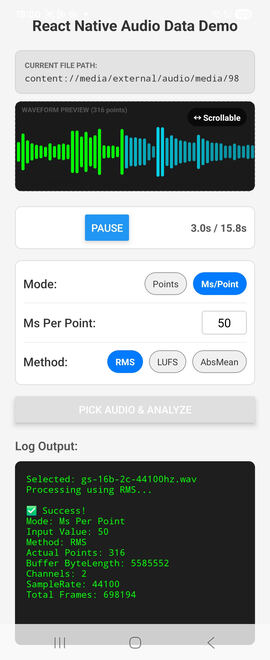

# react-native-audio-data

A React Native module that provides high-performance, cross-platform access to raw audio data for analysis, visualization, and custom DSP in JavaScript and native code.

Powered by [Nitro Modules](https://nitro.margelo.com/) and `dr_libs` for stable, efficient C++ audio decoding.



## Features

- ⚡️ **High Performance**: Uses C++ directly via JSI for near-native performance.
- � **Asynchronous**: All decoding and waveform generation runs on background threads to keep the UI smooth.
- �🪶 **Lightweight**: Zero heavy dependencies like FFmpeg. Uses `dr_libs` for minimal footprint.
- 🔊 **Format Support**: Decodes **MP3**, **WAV**, and **FLAC** files.
- 🌊 **Waveform Generation**: High-speed waveform data generation for visualization. Multiple methods supported including **RMS**, **LUFS** and **Abs Mean**.
- 🎹 **Raw PCM Data**: Access raw `Float32` audio samples for finding peaks, normalization, or custom processing.
- 📱 **Cross-Platform**: Works on **iOS** and **Android**.

## Installation

```sh
npm install react-native-audio-data react-native-nitro-modules
```

> **Note**: `react-native-nitro-modules` is a required peer dependency.

### Android Setup
No additional setup is required.

### iOS Setup
Install Pods:
```sh
cd ios && pod install
```

## Usage

### 1. Get Raw PCM Data

Decode an audio file to get the full raw PCM data (Float32).

```typescript
import { getRawPcmData } from 'react-native-audio-data';

// ...

try {
  const result = await getRawPcmData('path/to/audio/file.mp3');
  
  console.log('Channels:', result.channels);
  console.log('Sample Rate:', result.sampleRate);
  console.log('Total Frames:', result.totalPCMFrameCount);
  
  // The raw buffer (ArrayBuffer)
  // You can create a Float32Array view on it:
  const float32Data = new Float32Array(result.buffer);
  
} catch (error) {
  console.error("Failed to decode audio", error);
}
```

### 2. Generate Waveform Data

Quickly generate simplified waveform data for UI visualization (e.g., an audio player progress bar).

```typescript
import { getWaveformDataByPoints, getWaveformData } from 'react-native-audio-data';

// ...

// Option A: Request points by time resolution (e.g. one point every 50ms)
const timeBasedPoints = await getWaveformData('path/to/audio/file.mp3', 50);
console.log(timeBasedPoints);
// Output: [0.02, 0.45, ...] (length depends on audio duration)

// Option B: Request a fixed number of data points (e.g. 100 points)
const fixedPoints = await getWaveformDataByPoints('path/to/audio/file.mp3', 100);
console.log(fixedPoints); 
// Output: [0.05, 0.23, ...] (100 items)
```

## API Reference

### `getRawPcmData(filePath: string)`

Decodes the audio file and returns the raw PCM data.

- **Parameters**:
  - `filePath` _(string)_: Absolute path or URI to the audio file.
- **Returns**: `Promise<AudioDataResult>`
  - `buffer` _(ArrayBuffer)_: Raw PCM data (Float32).
  - `channels` _(number)_: Number of audio channels.
  - `sampleRate` _(number)_: Sample rate in Hz.
  - `totalPCMFrameCount` _(number)_: Total number of PCM frames.


### `getWaveformData(filePath: string, millisecondsPerPoint: number, method?: WaveformMethod)`

Generates a waveform where each point represents a specific duration of audio.

- **Parameters**:
  - `filePath` _(string)_: Absolute path or URI to the audio file.
  - `millisecondsPerPoint` _(number)_: The duration each point should represent (e.g., 100ms).
  - `method` _(WaveformMethod, optional)_: Calculation method. Values: `'RMS'` (default), `'AbsMean'`, `'LUFS'`.
- **Returns**: `Promise<number[]>` containing normalized values.

### `getWaveformDataByPoints(filePath: string, targetPoints: number, method?: WaveformMethod)`

Generates a waveform with a specific fixed number of points.

- **Parameters**:
  - `filePath` _(string)_: Absolute path or URI to the audio file.
  - `targetPoints` _(number)_: The number of data points you want in the output array.
  - `method` _(WaveformMethod, optional)_: Calculation method. Values: `'RMS'` (default), `'AbsMean'`, `'LUFS'`.
- **Returns**: `Promise<number[]>` containing normalized values.

### `resolveFilePath(filePath: string)`

Utility to resolve platform-specific file paths (e.g., Android Content URIs) to absolute system paths usable by C++.

- **Parameters**:
  - `filePath` _(string)_: The raw file path or URI.
- **Returns**: `Promise<string>` resolving to the absolute file path.

## Roadmap

- [ ] Support decoding while recording (Real-time Analysis)
- [x] Full multi-threading supported decoding

---

## Contributing

See the [contributing guide](CONTRIBUTING.md) to learn how to contribute to the repository and the development workflow.

## License

MIT
